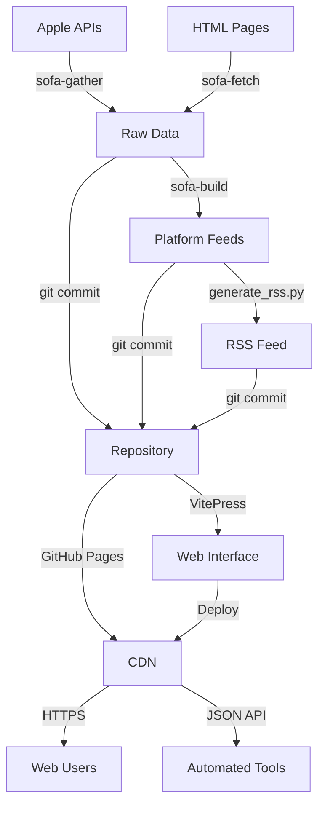

# SOFA 2.0 Public Repository Blueprint

## Executive Summary

SOFA 2.0 will be a **self-contained, auto-updating security data platform** that:
1. Starts with minimal binaries and configuration
2. Gathers Apple security data automatically via GitHub Actions
3. Commits results back to the repository
4. Serves data through a VitePress site on GitHub Pages
5. Provides both human-readable web interface and machine-readable JSON feeds

**Key Innovation:** The repository IS the database - all data stored as JSON files in git, providing version history, rollback capability, and CDN distribution via GitHub Pages.

## Architecture Overview

```
sofa-2.0/
├── .github/
│   ├── workflows/
│   │   ├── bootstrap.yml          # One-time setup
│   │   ├── update-data.yml         # Main pipeline (cron)
│   │   └── deploy-site.yml         # VitePress deployment
│   └── dependabot.yml
├── bin/                            # Pre-compiled static binaries
│   ├── sofa-gather                 # Data collection
│   ├── sofa-fetch                  # HTML scraping
│   └── sofa-build                  # Feed generation
├── config/                         # Minimal configuration
│   ├── gather.toml                 # URLs and settings
│   └── models.json                 # Platform definitions
├── data/                           # Generated data (git-tracked)
│   ├── raw/                        # Source data
│   │   ├── xprotect.json
│   │   ├── gdmf_macos.json
│   │   └── security_releases.json
│   ├── feeds/                      # Built feeds
│   │   ├── macos.json
│   │   ├── ios.json
│   │   └── rss.xml
│   └── archive/                    # Historical snapshots
├── site/                           # VitePress website
│   ├── .vitepress/
│   │   ├── config.ts               # Site configuration
│   │   └── theme/                  # Custom components
│   ├── index.md                    # Homepage
│   ├── api/                        # API documentation
│   └── dashboard/                  # Interactive dashboards
├── scripts/                        # Minimal Python scripts
│   └── generate_rss.py             # RSS generation
├── package.json                    # VitePress dependencies
└── README.md                       # Public documentation
```

## Phase 1: Minimal Viable Product (Week 1)

### 1.1 Core Components

```yaml
# Absolute minimum to start:
bin/
  sofa-gather         # 20MB static binary
  sofa-fetch          # 35MB static binary
  sofa-build          # 15MB static binary

config/
  gather.toml         # Just URLs
  
.github/workflows/
  update-data.yml     # Single workflow
```

### 1.2 Bootstrap Workflow

```yaml
# .github/workflows/bootstrap.yml
name: Bootstrap SOFA 2.0

on:
  workflow_dispatch:
  push:
    branches: [main]
    paths:
      - 'bin/**'
      - 'config/**'

jobs:
  initialize:
    runs-on: ubuntu-latest
    
    steps:
      - uses: actions/checkout@v4
        with:
          token: ${{ secrets.GITHUB_TOKEN }}
      
      - name: Make binaries executable
        run: chmod +x bin/*
      
      - name: Initial data gathering
        run: |
          # Gather all data sources
          ./bin/sofa-gather xprotect --output data/raw/xprotect.json
          ./bin/sofa-gather gdmf --output-dir data/raw/
          ./bin/sofa-fetch --output data/raw/security_releases.json
      
      - name: Build feeds
        run: |
          # Generate platform feeds
          ./bin/sofa-build macos --output data/feeds/macos.json
          ./bin/sofa-build ios --output data/feeds/ios.json
      
      - name: Commit data
        uses: stefanzweifel/git-auto-commit-action@v5
        with:
          commit_message: 'chore: initialize security data [automated]'
          file_pattern: 'data/**/*.json'
```

## Phase 2: Auto-Updating Pipeline (Week 2)

### 2.1 Main Update Workflow

```yaml
# .github/workflows/update-data.yml
name: Update Security Data

on:
  schedule:
    - cron: '0 */6 * * *'  # Every 6 hours
  workflow_dispatch:

jobs:
  check-and-update:
    runs-on: ubuntu-latest
    
    steps:
      - uses: actions/checkout@v4
        with:
          fetch-depth: 2
      
      - name: Setup environment
        run: |
          chmod +x bin/*
          echo "TIMESTAMP=$(date -u +%Y%m%d_%H%M%S)" >> $GITHUB_ENV
      
      - name: Gather fresh data
        id: gather
        run: |
          # Save current hashes
          find data/raw -name "*.json" -exec sha256sum {} \; > before.txt
          
          # Gather new data
          ./bin/sofa-gather xprotect --output data/raw/xprotect_new.json
          ./bin/sofa-gather gdmf --output-dir data/raw/
          ./bin/sofa-fetch --output data/raw/security_releases_new.json
          
          # Check for changes
          CHANGED=false
          for file in data/raw/*_new.json; do
            base=$(basename $file _new.json)
            if [ -f "data/raw/${base}.json" ]; then
              if ! cmp -s "$file" "data/raw/${base}.json"; then
                CHANGED=true
                mv "$file" "data/raw/${base}.json"
              else
                rm "$file"
              fi
            else
              CHANGED=true
              mv "$file" "data/raw/${base}.json"
            fi
          done
          
          echo "changed=$CHANGED" >> $GITHUB_OUTPUT
      
      - name: Build feeds if changed
        if: steps.gather.outputs.changed == 'true'
        run: |
          # Rebuild all feeds
          for platform in macos ios tvos watchos visionos; do
            ./bin/sofa-build $platform --output data/feeds/${platform}.json
          done
          
          # Generate RSS
          ./scripts/generate_rss.py --output data/feeds/rss.xml
          
          # Create archive snapshot
          mkdir -p data/archive/${{ env.TIMESTAMP }}
          cp data/raw/*.json data/archive/${{ env.TIMESTAMP }}/
      
      - name: Update metadata
        if: steps.gather.outputs.changed == 'true'
        run: |
          cat > data/metadata.json << EOF
          {
            "last_updated": "$(date -u +%Y-%m-%dT%H:%M:%SZ)",
            "version": "2.0.0",
            "data_version": "${{ env.TIMESTAMP }}",
            "sources": {
              "xprotect": "$(jq -r .release_date data/raw/xprotect.json)",
              "gdmf": "$(date -u +%Y-%m-%d)",
              "security": "$(date -u +%Y-%m-%d)"
            }
          }
          EOF
      
      - name: Commit changes
        if: steps.gather.outputs.changed == 'true'
        uses: stefanzweifel/git-auto-commit-action@v5
        with:
          commit_message: 'feat: update security data ${{ env.TIMESTAMP }} [automated]'
          file_pattern: 'data/**'
```

## Phase 3: VitePress Site (Week 3)

### 3.1 Site Structure

```typescript
// site/.vitepress/config.ts
import { defineConfig } from 'vitepress'
import { generateDataRoutes } from './theme/data-loader'

export default defineConfig({
  title: 'SOFA 2.0',
  description: 'Apple Security Data Platform',
  base: '/sofa-2.0/',
  
  themeConfig: {
    nav: [
      { text: 'Dashboard', link: '/dashboard/' },
      { text: 'API', link: '/api/' },
      { text: 'RSS', link: '/data/feeds/rss.xml' }
    ],
    
    sidebar: {
      '/api/': [
        { text: 'Getting Started', link: '/api/' },
        { text: 'Endpoints', link: '/api/endpoints' },
        { text: 'Data Format', link: '/api/format' }
      ]
    }
  },
  
  vite: {
    server: {
      fs: {
        allow: ['../data']
      }
    }
  }
})
```

### 3.2 Dashboard Component

```vue
<!-- site/.vitepress/theme/Dashboard.vue -->
<template>
  <div class="dashboard">
    <h1>SOFA Security Dashboard</h1>
    
    <div class="stats">
      <StatCard 
        title="Latest macOS" 
        :value="data.macos?.latest_version"
        :subtitle="data.macos?.release_date"
      />
      <StatCard 
        title="XProtect Version" 
        :value="data.xprotect?.config_version"
        :subtitle="data.xprotect?.release_date"
      />
      <StatCard 
        title="Active CVEs" 
        :value="stats.active_cves"
        :subtitle="`${stats.exploited} exploited`"
      />
    </div>
    
    <div class="charts">
      <UpdateTimeline :data="timeline" />
      <PlatformGrid :platforms="platforms" />
    </div>
    
    <div class="data-table">
      <ReleaseTable :releases="releases" />
    </div>
  </div>
</template>

<script setup>
import { ref, onMounted } from 'vue'
import { loadData } from './data-loader'

const data = ref({})
const stats = ref({})
const timeline = ref([])
const platforms = ref([])
const releases = ref([])

onMounted(async () => {
  // Load JSON data from repository
  data.value = await loadData()
  stats.value = calculateStats(data.value)
  timeline.value = generateTimeline(data.value)
  platforms.value = extractPlatforms(data.value)
  releases.value = extractReleases(data.value)
})
</script>
```

### 3.3 API Endpoints (via GitHub Pages)

```markdown
# site/api/index.md
# SOFA 2.0 API

All data is available as static JSON files via GitHub Pages:

## Endpoints

### Platform Feeds
- macOS: `https://[org].github.io/sofa-2.0/data/feeds/macos.json`
- iOS: `https://[org].github.io/sofa-2.0/data/feeds/ios.json`
- RSS: `https://[org].github.io/sofa-2.0/data/feeds/rss.xml`

### Raw Data
- XProtect: `https://[org].github.io/sofa-2.0/data/raw/xprotect.json`
- GDMF: `https://[org].github.io/sofa-2.0/data/raw/gdmf_macos.json`

### Metadata
- Status: `https://[org].github.io/sofa-2.0/data/metadata.json`

## Usage Examples

```javascript
// Fetch latest macOS data
fetch('https://[org].github.io/sofa-2.0/data/feeds/macos.json')
  .then(r => r.json())
  .then(data => console.log(data))
```
```

## Phase 4: Deployment Strategy

### 4.1 GitHub Pages Workflow

```yaml
# .github/workflows/deploy-site.yml
name: Deploy VitePress Site

on:
  push:
    branches: [main]
    paths:
      - 'site/**'
      - 'data/**'
  workflow_run:
    workflows: ["Update Security Data"]
    types: [completed]

jobs:
  deploy:
    runs-on: ubuntu-latest
    
    steps:
      - uses: actions/checkout@v4
      
      - name: Setup Node.js
        uses: actions/setup-node@v4
        with:
          node-version: 20
          cache: npm
      
      - name: Install dependencies
        run: |
          cd site
          npm ci
      
      - name: Build VitePress site
        run: |
          cd site
          npm run build
          
          # Copy data files to dist
          cp -r ../data .vitepress/dist/
      
      - name: Deploy to GitHub Pages
        uses: peaceiris/actions-gh-pages@v3
        with:
          github_token: ${{ secrets.GITHUB_TOKEN }}
          publish_dir: ./site/.vitepress/dist
          cname: sofa.example.com  # Optional custom domain
```

## Implementation Roadmap

### Week 1: Foundation
```bash
# 1. Create new repository
gh repo create sofa-2.0 --public

# 2. Copy minimal files
cp -r bin/ config/ scripts/generate_rss.py sofa-2.0/

# 3. Create workflows
mkdir -p sofa-2.0/.github/workflows
cp bootstrap.yml update-data.yml sofa-2.0/.github/workflows/

# 4. Initial commit and bootstrap
cd sofa-2.0
git add .
git commit -m "feat: initial SOFA 2.0 setup"
git push

# 5. Run bootstrap workflow
gh workflow run bootstrap.yml
```

### Week 2: Automation
- Enable scheduled workflows
- Test update detection
- Implement data archiving
- Add error handling

### Week 3: Web Interface
```bash
# Initialize VitePress
cd site
npm init vite@latest
npm install -D vitepress vue

# Create components
mkdir -p .vitepress/theme/components
# Add dashboard, charts, tables

# Build and test
npm run dev
npm run build
```

### Week 4: Polish
- Custom domain setup
- Analytics integration
- API documentation
- Performance optimization

## Key Design Decisions

### 1. Repository as Database
**Why:** 
- Free hosting via GitHub Pages
- Built-in version control
- CDN distribution
- No backend needed

**Trade-offs:**
- Repo size will grow (~100MB/year)
- Git history as audit log
- Can use Git LFS if needed

### 2. Static Binaries
**Why:**
- No runtime dependencies
- Consistent execution
- Fast startup
- Works on any Linux

**Implementation:**
```dockerfile
# Build once, use everywhere
FROM rust:alpine AS builder
RUN cargo build --release --target x86_64-unknown-linux-musl
```

### 3. VitePress for UI
**Why:**
- Static site generation
- Vue.js components
- Markdown support
- Fast build times
- Great DX

### 4. GitHub Actions Only
**Why:**
- No external CI/CD
- 2000 free minutes/month
- Integrated with repository
- Secrets management

## Data Flow Architecture



## Security Considerations

### 1. Workflow Permissions
```yaml
permissions:
  contents: write      # Commit data
  pages: write        # Deploy site
  id-token: write     # OIDC for deployment
```

### 2. Branch Protection
- Require PR reviews for config changes
- Allow automated commits to data/
- Protect main branch

### 3. Secret Management
- No API keys needed (all public data)
- GitHub token auto-provided
- Optional: custom domain SSL

## Monitoring and Alerts

### 1. Health Check
```yaml
# .github/workflows/health-check.yml
on:
  schedule:
    - cron: '0 0 * * *'

jobs:
  check:
    steps:
      - name: Verify data freshness
        run: |
          LAST_UPDATE=$(curl -s https://[org].github.io/sofa-2.0/data/metadata.json | jq -r .last_updated)
          AGE=$(($(date +%s) - $(date -d "$LAST_UPDATE" +%s)))
          if [ $AGE -gt 86400 ]; then
            echo "::error::Data is stale!"
            exit 1
          fi
```

### 2. Metrics Dashboard
- Update frequency
- Data size growth
- Error rates
- API usage (via GitHub insights)

## Cost Analysis

### GitHub Resources Used
- **Actions:** ~300 minutes/month (well within 2000 free)
- **Pages:** Unlimited bandwidth
- **Storage:** ~100MB growing ~10MB/month
- **API calls:** None (all static)

### Total Cost
**$0/month** - Everything within GitHub free tier

## Success Criteria

### Phase 1 (MVP)
- [ ] Binaries execute successfully
- [ ] Data gathering works
- [ ] Automated commits working
- [ ] Basic JSON feeds available

### Phase 2 (Automation)
- [ ] Scheduled updates running
- [ ] Change detection working
- [ ] No manual intervention needed
- [ ] Error recovery implemented

### Phase 3 (Web)
- [ ] VitePress site live
- [ ] Dashboard functional
- [ ] API documented
- [ ] Mobile responsive

### Phase 4 (Production)
- [ ] 99.9% uptime
- [ ] < 1 hour data freshness
- [ ] < 1 second page load
- [ ] Zero maintenance required

## Conclusion

SOFA 2.0 is designed to be a **truly autonomous security data platform** that:
1. Requires zero infrastructure
2. Costs nothing to operate
3. Updates itself automatically
4. Provides both human and machine interfaces
5. Scales infinitely via GitHub's CDN

The key innovation is using the **repository itself as the database**, with GitHub Pages as the API server and VitePress as the UI layer. This creates a self-contained, self-updating, self-documenting system that requires minimal maintenance once deployed.