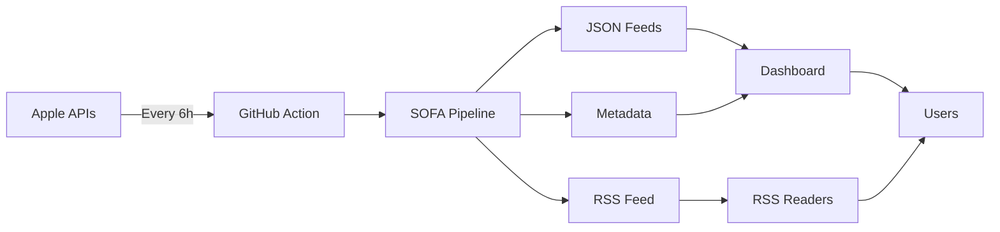

# SOFA Automated Feed Generation Process

## Overview

SOFA (Simple Organized Feed for Apple Software Updates) runs an automated pipeline that checks Apple's software update APIs every 6 hours, processes the data, and updates the dashboard with the latest information about macOS, iOS, tvOS, watchOS, visionOS, and Safari updates.

## Schedule & Frequency

The pipeline runs automatically via GitHub Actions:

- **Frequency**: Every 6 hours
- **Schedule**: 00:00, 06:00, 12:00, 18:00 UTC
- **Duration**: ~5-10 minutes per run
- **Manual Trigger**: Available via GitHub Actions UI

## Pipeline Architecture

```
┌─────────────────┐
│  GitHub Action  │ ◄── Triggered by schedule (cron: '0 */6 * * *')
└────────┬────────┘     or manual dispatch
         │
         ▼
┌─────────────────┐
│  Environment    │ ◄── Ubuntu latest, Python with uv
│     Setup       │     Creates directories, sets timestamps
└────────┬────────┘
         │
         ▼
┌─────────────────────────────────────────────────────┐
│                   GATHER STAGE                       │
├───────────────────────────────────────────────────────┤
│  Fetches raw data from Apple sources:                │
│  • KEV Catalog - Known Exploited Vulnerabilities     │
│  • GDMF - macOS version catalog                      │
│  • IPSW API - iOS/iPadOS firmware data              │
│  • XProtect - Apple security definitions             │
│  • Beta feeds - Developer/public beta releases       │
│  • UMA Catalog - Update metadata                     │
└────────┬──────────────────────────────────────────────┘
         │
         ▼
┌─────────────────────────────────────────────────────┐
│                   FETCH STAGE                        │
├───────────────────────────────────────────────────────┤
│  Enriches data with security information:            │
│  • CVE details from Apple security releases          │
│  • Security content from release notes               │
│  • Update package information                        │
│  • Build numbers and versions                        │
└────────┬──────────────────────────────────────────────┘
         │
         ▼
┌─────────────────────────────────────────────────────┐
│                   BUILD STAGE                        │
├───────────────────────────────────────────────────────┤
│  Generates platform-specific feeds:                  │
│  • v1 format feeds (legacy compatibility)            │
│  • v2 format feeds (enhanced structure)              │
│  • Update SHA-256 hashes for verification            │
│  • Timestamp metadata for each platform              │
└────────┬──────────────────────────────────────────────┘
         │
         ▼
┌─────────────────────────────────────────────────────┐
│                  POST-PROCESSING                     │
├───────────────────────────────────────────────────────┤
│  Creates final outputs:                              │
│  • RSS feed generation for subscribers               │
│  • Bulletin data for homepage                        │
│  • feed_metadata.json sync for dashboard             │
│  • Statistics and summary generation                 │
└────────┬──────────────────────────────────────────────┘
         │
         ▼
┌─────────────────────────────────────────────────────┐
│                   GIT COMMIT                         │
├───────────────────────────────────────────────────────┤
│  Commits changes if any:                             │
│  • Automated commit message with timestamp           │
│  • Push to main branch                               │
│  • Triggers site rebuild                             │
└────────┬──────────────────────────────────────────────┘
         │
         ▼
┌─────────────────┐
│   Dashboard     │ ◄── Updates reflect in ~5 minutes
│   Updates       │     Shows live feed status
└─────────────────┘
```

## Key Files Updated

### Feed Files
| File | Description | Update Frequency |
|------|-------------|------------------|
| `/data/feeds/v1/*.json` | Legacy format feeds | Every run with changes |
| `/data/feeds/v2/*.json` | New enhanced format feeds | Every run with changes |
| `/data/feeds/v2/last_feed_timestamp.json` | Pipeline metadata with hashes | Every successful run |
| `/data/feeds/v2/feed_metadata.json` | Dashboard metadata (synced) | Every successful run |

### Content Files
| File | Description | Update Frequency |
|------|-------------|------------------|
| `/data/resources/bulletin_data.json` | Homepage latest releases | When new releases detected |
| `/v1/rss_feed.xml` | RSS feed for subscribers | When content changes |
| `/data/resources/apple_security_releases.json` | Security release database | When Apple publishes |

## Expected Behaviors

### ✅ Successful Run (No Updates)
- Pipeline completes in ~5 minutes
- Timestamps updated to current time
- Hashes remain unchanged
- No git commit (avoids repository noise)
- Dashboard shows "Live" status (green indicator)
- Next run scheduled in 6 hours

### ✅ Successful Run (With Updates)
- Pipeline detects new versions or security releases
- All feeds regenerated with new content
- Update hashes change to reflect new data
- Git commit with descriptive message
- Dashboard immediately shows new versions
- RSS subscribers receive updates

### ⚠️ Partial Failure
- Some data sources unavailable (common for beta feeds)
- Pipeline continues with available data
- Warning logged but process continues
- Partial data updates committed
- Dashboard shows "Degraded" if critical feeds fail

### ❌ Complete Failure
- Critical error prevents pipeline completion
- Previous data remains unchanged
- No commit or data corruption
- Error notification in GitHub Actions
- Dashboard shows "Stale" after 24 hours
- Manual intervention may be required

## Dashboard Status Indicators

The dashboard displays real-time feed health:

| Status | Indicator | Condition | Meaning |
|--------|-----------|-----------|---------|
| **Live** | 🟢 Green | < 1 hour old | Feeds are current |
| **Recent** | 🟡 Yellow | < 24 hours old | Feeds are acceptable |
| **Stale** | 🔴 Red | > 24 hours old | Feeds need attention |
| **Unknown** | ⚫ Gray | No timestamp | Data unavailable |

## Data Flow Example



## Manual Operations

### Trigger Manual Update
```bash
# Via GitHub UI:
# 1. Go to Actions tab
# 2. Select "SOFA Feed Updates"
# 3. Click "Run workflow"
# 4. Optional: Enable debug mode

# Via GitHub CLI:
gh workflow run sofa-feeds.yml
```

### Check Pipeline Status
```bash
# View latest runs
gh run list --workflow=sofa-feeds.yml

# View specific run details
gh run view [RUN_ID]

# Watch run in progress
gh run watch
```

### Verify Feed Freshness
```bash
# Check metadata
curl https://[your-site]/data/feeds/v2/feed_metadata.json | jq '.feeds.macos.last_check'

# Compare with current time
date -u +%Y-%m-%dT%H:%M:%SZ
```

## Monitoring & Alerts

### Automated Monitoring
- GitHub Actions sends email on failure (configurable)
- Dashboard shows visual feed status
- RSS feed includes update timestamps
- Commit history shows update frequency

### Health Checks
1. **Feed Age**: Check if feeds are updating regularly
2. **Hash Changes**: Verify content is changing when Apple releases updates
3. **Pipeline Duration**: Monitor for unusual processing times
4. **Error Rates**: Track failure frequency

### Key Metrics
- **Update Frequency**: Should see ~4 updates daily
- **Success Rate**: Target >95% successful runs
- **Processing Time**: Typically 5-10 minutes
- **Data Freshness**: Always <6 hours during normal operation

## Troubleshooting

### Common Issues

| Issue | Cause | Solution |
|-------|-------|----------|
| Feeds showing "Stale" | Pipeline hasn't run in 24h | Check GitHub Actions for failures |
| No new updates detected | Apple hasn't released updates | Normal behavior, check Apple's site |
| Pipeline timeout | Network issues or API limits | Will retry on next schedule |
| Partial data | Some APIs unavailable | Usually self-resolves |

### Debug Commands
```bash
# Check last pipeline run
gh run view --log

# Test pipeline locally
./scripts/sofa_pipeline.py run --verbose

# Verify data integrity
./scripts/sofa_pipeline.py validate

# Force update
gh workflow run sofa-feeds.yml -f force_update=true
```

## Configuration

### Enable Automation
To enable automated updates, uncomment the schedule in `.github/workflows/sofa-feeds.yml`:

```yaml
on:
  schedule:
    # Uncomment the line below to enable
    - cron: '0 */6 * * *'
```

### Adjust Frequency
Modify the cron expression for different schedules:
- `0 */4 * * *` - Every 4 hours
- `0 */12 * * *` - Every 12 hours  
- `0 0 * * *` - Daily at midnight
- `0 9,17 * * *` - Twice daily (9 AM and 5 PM)

### Environment Variables
Configure in GitHub repository settings:
- `GITHUB_TOKEN` - Automatically provided
- `SOFA_DEBUG` - Enable verbose logging (optional)
- `NOTIFICATION_EMAIL` - For failure alerts (optional)

## Security Considerations

- **Read-only operations**: Pipeline only reads from Apple APIs
- **No credentials stored**: Uses public APIs only
- **Signed commits**: Can be enabled for verification
- **Hash verification**: All updates include SHA-256 hashes
- **Audit trail**: Complete history in git commits

## Performance Optimization

The pipeline is optimized for efficiency:
- Parallel API requests where possible
- Incremental updates (only changed files)
- Cached dependencies in GitHub Actions
- Minimal git history (no large files)
- CDN-friendly static JSON output

## Future Enhancements

Planned improvements:
- [ ] Webhook notifications for critical updates
- [ ] Differential feeds (only changes)
- [ ] API rate limit monitoring
- [ ] Automated rollback on errors
- [ ] Performance metrics dashboard
- [ ] Multi-region deployment

## Support

For issues or questions:
1. Check GitHub Actions logs
2. Review this documentation
3. Open an issue on GitHub
4. Contact the maintainers

---

*Last updated: 2024-08-27*
*Version: 1.0.0*