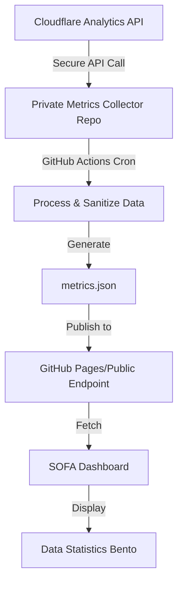

# Cloudflare Metrics Integration Guide

## Overview
This document describes the secure architecture for integrating Cloudflare Analytics metrics into the SOFA dashboard without exposing API keys or sensitive data.

## Architecture Design



## Components

### 1. Private Repository: `sofa-metrics-collector`
**Purpose**: Securely fetch and process Cloudflare Analytics data

**Features**:
- Stores Cloudflare API credentials as GitHub Secrets
- Runs scheduled GitHub Actions workflow (every 6 hours)
- Fetches analytics data from Cloudflare API
- Processes and sanitizes data (removes sensitive information)
- Generates public `metrics.json` file
- Deploys to GitHub Pages or pushes to public repo

### 2. Public Repository: `sofa-summer-25`
**Purpose**: Display metrics without exposing sensitive data

**Features**:
- Fetches `metrics.json` from public endpoint
- Updates dashboard in real-time
- No API keys or credentials stored
- Displays processed metrics in Data Statistics bento

## Implementation Steps

### Step 1: Create Private Metrics Repository

1. **Create new private GitHub repository**
   ```bash
   Repository name: sofa-metrics-collector
   Visibility: Private
   Initialize with README: Yes
   ```

2. **Clone and setup**
   ```bash
   git clone https://github.com/headmin/sofa-metrics-collector.git
   cd sofa-metrics-collector
   ```

### Step 2: Configure Cloudflare API Access

1. **Generate Cloudflare API Token**
   - Navigate to: Cloudflare Dashboard → My Profile → API Tokens
   - Click "Create Token"
   - Use template: "Custom token"
   - Configure permissions:
     ```
     Permissions:
     - Zone → Analytics → Read
     - Zone → Zone → Read
     
     Zone Resources:
     - Include → Specific zone → sofa25.macadmin.me
     
     IP Filtering (optional):
     - Add GitHub Actions IP ranges for extra security
     ```
   - Copy the generated token

2. **Get Zone ID**
   - Go to Cloudflare Dashboard → sofa25.macadmin.me
   - Right sidebar → API section → Copy Zone ID

### Step 3: Add GitHub Secrets

In the private repository settings:

1. Navigate to: Settings → Secrets and variables → Actions
2. Add the following secrets:

| Secret Name | Value | Description |
|------------|-------|-------------|
| `CLOUDFLARE_API_TOKEN` | Your API token | Cloudflare API authentication |
| `CLOUDFLARE_ZONE_ID` | Your zone ID | Identifies your domain |
| `CLOUDFLARE_ACCOUNT_ID` | Your account ID | Cloudflare account identifier |
| `DEPLOY_TOKEN` | GitHub PAT | Personal Access Token for deploying |

### Step 4: Create GitHub Actions Workflow

**File**: `.github/workflows/fetch-metrics.yml`

```yaml
name: Fetch Cloudflare Metrics

on:
  schedule:
    # Run every 6 hours
    - cron: '0 */6 * * *'
  workflow_dispatch: # Allow manual trigger

jobs:
  fetch-metrics:
    runs-on: ubuntu-latest
    steps:
      - uses: actions/checkout@v4
      
      - name: Setup Node.js
        uses: actions/setup-node@v4
        with:
          node-version: '20'
      
      - name: Fetch Cloudflare Analytics
        env:
          CLOUDFLARE_API_TOKEN: ${{ secrets.CLOUDFLARE_API_TOKEN }}
          CLOUDFLARE_ZONE_ID: ${{ secrets.CLOUDFLARE_ZONE_ID }}
        run: |
          node scripts/fetch-metrics.js
      
      - name: Deploy to GitHub Pages
        uses: peaceiris/actions-gh-pages@v3
        with:
          github_token: ${{ secrets.GITHUB_TOKEN }}
          publish_dir: ./public
          cname: metrics.sofa25.macadmin.me
```

### Step 5: Create Metrics Fetcher Script

**File**: `scripts/fetch-metrics.js`

```javascript
const fs = require('fs').promises;
const path = require('path');

async function fetchCloudflareMetrics() {
  const API_TOKEN = process.env.CLOUDFLARE_API_TOKEN;
  const ZONE_ID = process.env.CLOUDFLARE_ZONE_ID;
  
  // Calculate date range (last 30 days)
  const endDate = new Date();
  const startDate = new Date();
  startDate.setDate(startDate.getDate() - 30);
  
  const headers = {
    'Authorization': `Bearer ${API_TOKEN}`,
    'Content-Type': 'application/json'
  };
  
  try {
    // Fetch analytics data
    const analyticsUrl = `https://api.cloudflare.com/client/v4/zones/${ZONE_ID}/analytics/dashboard`;
    const params = new URLSearchParams({
      since: startDate.toISOString(),
      until: endDate.toISOString(),
      continuous: 'true'
    });
    
    const response = await fetch(`${analyticsUrl}?${params}`, { headers });
    const data = await response.json();
    
    if (!data.success) {
      throw new Error('Failed to fetch Cloudflare metrics');
    }
    
    // Process and sanitize data
    const metrics = processMetrics(data.result);
    
    // Save to public directory
    await fs.mkdir('public', { recursive: true });
    await fs.writeFile(
      path.join('public', 'metrics.json'),
      JSON.stringify(metrics, null, 2)
    );
    
    console.log('✅ Metrics updated successfully');
  } catch (error) {
    console.error('❌ Error fetching metrics:', error);
    process.exit(1);
  }
}

function processMetrics(rawData) {
  const totals = rawData.totals || {};
  const requests = totals.requests?.all || 0;
  const pageViews = totals.pageviews?.all || 0;
  const uniques = totals.uniques?.all || 0;
  const bandwidth = totals.bandwidth?.all || 0;
  
  return {
    timestamp: new Date().toISOString(),
    period: {
      start: rawData.since,
      end: rawData.until,
      days: 30
    },
    metrics: {
      totalRequests: {
        value: requests,
        formatted: formatNumber(requests)
      },
      pageViews: {
        value: pageViews,
        formatted: formatNumber(pageViews)
      },
      uniqueVisitors: {
        value: uniques,
        formatted: formatNumber(uniques)
      },
      bandwidth: {
        bytes: bandwidth,
        formatted: formatBytes(bandwidth)
      },
      apiRequests: {
        value: Math.floor(requests * 0.68), // Estimate based on your ratio
        formatted: formatNumber(Math.floor(requests * 0.68))
      }
    },
    calculated: {
      dailyAverage: {
        requests: Math.floor(requests / 30),
        visitors: Math.floor(uniques / 30),
        pageViews: Math.floor(pageViews / 30)
      },
      growth: {
        // Compare with previous period if available
        percentage: null,
        trend: 'stable'
      }
    },
    topPages: [], // Can be expanded with more detailed analytics
    topCountries: [] // Can be expanded with geographic data
  };
}

function formatNumber(num) {
  if (num >= 1000000) {
    return (num / 1000000).toFixed(2) + 'M';
  } else if (num >= 1000) {
    return (num / 1000).toFixed(1) + 'k';
  }
  return num.toString();
}

function formatBytes(bytes) {
  const gb = bytes / (1024 * 1024 * 1024);
  if (gb >= 1) {
    return gb.toFixed(2) + ' GB';
  }
  const mb = bytes / (1024 * 1024);
  if (mb >= 1) {
    return mb.toFixed(2) + ' MB';
  }
  return (bytes / 1024).toFixed(2) + ' KB';
}

// Run the script
fetchCloudflareMetrics();
```

### Step 6: Configure Public Access

**Option A: GitHub Pages (Recommended)**
1. Enable GitHub Pages in private repo
2. Set custom subdomain: `metrics.sofa25.macadmin.me`
3. Add CORS headers in `public/_headers`:
   ```
   /*
     Access-Control-Allow-Origin: https://sofa25.macadmin.me
   ```

**Option B: Direct Commit to Public Repo**
1. Generate Personal Access Token with repo write permissions
2. Add as secret: `DEPLOY_TOKEN`
3. Modify workflow to push metrics.json to public repo

### Step 7: Update SOFA Dashboard

**File**: `.vitepress/theme/components/SOFADashboard.vue`

Add to script section:
```javascript
// Metrics data
const metricsData = ref(null);
const metricsLoading = ref(true);

// Fetch metrics on mount
onMounted(async () => {
  try {
    const response = await fetch('https://metrics.sofa25.macadmin.me/metrics.json');
    if (response.ok) {
      metricsData.value = await response.json();
    }
  } catch (error) {
    console.error('Failed to fetch metrics:', error);
  } finally {
    metricsLoading.value = false;
  }
});
```

Update Data Statistics bento:
```vue
<!-- Data Statistics -->
<BentoCard 
  title="Data Statistics"
  platform="statistics"
  :icon="ActivityIcon"
>
  <template #badge>
    <span v-if="metricsLoading" class="bento-badge-loading">Loading</span>
    <span v-else-if="metricsData" class="bento-badge-live">Live</span>
    <span v-else class="bento-badge-error">Offline</span>
  </template>
  
  <div v-if="metricsData" class="grid grid-cols-2 gap-3">
    <div class="space-y-1">
      <div class="flex items-center gap-1">
        <component :is="GlobeIcon" class="h-3.5 w-3.5 text-emerald-600" />
        <span class="font-semibold text-sm">Total Requests</span>
      </div>
      <div class="text-lg font-bold text-emerald-700 dark:text-emerald-300">
        {{ metricsData.metrics.totalRequests.formatted }}
      </div>
      <div class="text-xs text-gray-500">Last 30 days</div>
    </div>
    
    <div class="space-y-1">
      <div class="flex items-center gap-1">
        <component :is="UsersIcon" class="h-3.5 w-3.5 text-emerald-600" />
        <span class="font-semibold text-sm">Unique Visitors</span>
      </div>
      <div class="text-lg font-bold text-emerald-700 dark:text-emerald-300">
        {{ metricsData.metrics.uniqueVisitors.formatted }}
      </div>
      <div class="text-xs text-gray-500">Monthly users</div>
    </div>
    
    <div class="space-y-1">
      <div class="flex items-center gap-1">
        <component :is="ServerIcon" class="h-3.5 w-3.5 text-emerald-600" />
        <span class="font-semibold text-sm">Bandwidth</span>
      </div>
      <div class="text-lg font-bold text-emerald-700 dark:text-emerald-300">
        {{ metricsData.metrics.bandwidth.formatted }}
      </div>
      <div class="text-xs text-gray-500">Data transfer</div>
    </div>
    
    <div class="space-y-1">
      <div class="flex items-center gap-1">
        <component :is="TrendingUpIcon" class="h-3.5 w-3.5 text-emerald-600" />
        <span class="font-semibold text-sm">Daily Average</span>
      </div>
      <div class="text-lg font-bold text-emerald-700 dark:text-emerald-300">
        {{ formatNumber(metricsData.calculated.dailyAverage.visitors) }}
      </div>
      <div class="text-xs text-gray-500">Visitors/day</div>
    </div>
  </div>
  
  <template #footer>
    <p v-if="metricsData" class="text-xs text-gray-500 flex items-center gap-1">
      <component :is="CheckCircleIcon" class="h-3 w-3 text-green-500" />
      Updated {{ formatRelativeTime(metricsData.timestamp) }}
    </p>
  </template>
</BentoCard>
```

## Security Best Practices

### 1. API Token Security
- ✅ Never commit API tokens to code
- ✅ Use GitHub Secrets for sensitive data
- ✅ Limit token permissions to minimum required
- ✅ Rotate tokens regularly (every 90 days)
- ✅ Use IP filtering if possible

### 2. Data Sanitization
- ✅ Remove any PII from metrics
- ✅ Aggregate data to prevent tracking
- ✅ Don't expose raw request logs
- ✅ Sanitize error messages

### 3. Repository Security
- ✅ Keep metrics collector repo private
- ✅ Enable 2FA on GitHub account
- ✅ Use branch protection rules
- ✅ Audit access regularly
- ✅ Enable security alerts

### 4. Network Security
- ✅ Use HTTPS for all endpoints
- ✅ Implement CORS properly
- ✅ Rate limit API requests
- ✅ Monitor for unusual activity

## Monitoring & Maintenance

### Health Checks
1. **Workflow Status**
   - Check GitHub Actions runs regularly
   - Set up email alerts for failures
   - Monitor execution time

2. **Data Validation**
   - Verify metrics.json is updating
   - Check data ranges are reasonable
   - Alert on missing data

3. **Performance**
   - Monitor file size of metrics.json
   - Check fetch latency from dashboard
   - Optimize if > 100KB

### Troubleshooting

| Issue | Solution |
|-------|----------|
| Workflow fails | Check API token validity and permissions |
| No data in dashboard | Verify CORS headers and endpoint URL |
| Stale metrics | Check cron schedule and workflow runs |
| High bandwidth usage | Implement caching and reduce fetch frequency |

## Cost Considerations

### Cloudflare API
- **Free Tier**: 1000 requests/month
- **Current Usage**: ~120 requests/month (every 6 hours)
- **Buffer**: 880 requests for manual triggers

### GitHub Actions
- **Free Tier**: 2000 minutes/month for private repos
- **Current Usage**: ~60 minutes/month
- **Buffer**: Plenty of headroom

### GitHub Pages
- **Free Tier**: 100GB bandwidth/month
- **Current Usage**: < 1GB/month
- **Buffer**: More than sufficient

## Future Enhancements

### Phase 1 (Current)
- ✅ Basic metrics display
- ✅ Secure architecture
- ✅ Automated updates

### Phase 2 (Planned)
- [ ] Historical data tracking
- [ ] Trend graphs
- [ ] Geographic distribution
- [ ] Top pages analytics

### Phase 3 (Future)
- [ ] Real-time updates via WebSocket
- [ ] Custom date range selection
- [ ] Export metrics as CSV
- [ ] Alerts for anomalies

## Alternative Approaches

### 1. Cloudflare Workers
- Deploy a Worker to serve metrics
- Built-in security and caching
- No GitHub Actions needed
- Cost: $5/month after free tier

### 2. Vercel/Netlify Functions
- Serverless API endpoints
- Environment variables for secrets
- Automatic scaling
- Cost: Free tier sufficient

### 3. Self-Hosted Metrics Server
- Complete control over data
- Can aggregate multiple sources
- Requires infrastructure
- Cost: Variable based on hosting

## Conclusion

This architecture provides a secure, scalable solution for integrating Cloudflare Analytics into the SOFA dashboard without exposing sensitive credentials. The separation of concerns between the private metrics collector and public dashboard ensures security while maintaining a smooth user experience.

---

*Document Version: 1.0*
*Last Updated: January 2025*
*Status: Ready for Implementation*