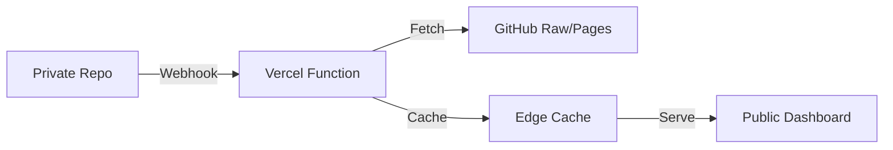
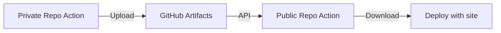

# Metrics Delivery Methods: Private to Public Repository

## Overview
How to securely deliver metrics.json from the private metrics collector to the public SOFA dashboard.

## Method 1: GitHub Pages (RECOMMENDED) ✅

**Private Repo hosts metrics on GitHub Pages**


### Implementation
1. **Private repo deploys to GitHub Pages**:
```yaml
# In private repo: .github/workflows/fetch-metrics.yml
- name: Deploy metrics to GitHub Pages
  uses: peaceiris/actions-gh-pages@v3
  with:
    github_token: ${{ secrets.GITHUB_TOKEN }}
    publish_dir: ./public
    cname: metrics.sofa25.macadmin.me  # Subdomain for metrics
```

2. **Configure CORS in private repo**:
```javascript
// public/_headers
/*
  Access-Control-Allow-Origin: https://sofa25.macadmin.me
  Access-Control-Allow-Methods: GET
  Cache-Control: max-age=300
```

3. **Public repo fetches via HTTPS**:
```javascript
// In SOFADashboard.vue
const response = await fetch('https://metrics.sofa25.macadmin.me/metrics.json');
```

**Pros:**
- ✅ No API tokens needed in public repo
- ✅ Built-in CDN and caching
- ✅ Simple HTTPS endpoint
- ✅ Free with GitHub

**Cons:**
- Requires DNS subdomain setup
- Slight delay in propagation

---

## Method 2: Direct Push via GitHub API

**Private repo pushes metrics.json to public repo**


### Implementation
```yaml
# In private repo: .github/workflows/fetch-metrics.yml
- name: Push metrics to public repo
  run: |
    # Configure git
    git config --global user.email "bot@sofa25.macadmin.me"
    git config --global user.name "SOFA Metrics Bot"
    
    # Clone public repo
    git clone https://${{ secrets.PUBLIC_REPO_TOKEN }}@github.com/headmin/sofa-summer-25.git public-repo
    
    # Copy metrics
    cp public/metrics.json public-repo/public/v1/metrics.json
    
    # Commit and push
    cd public-repo
    git add public/v1/metrics.json
    git commit -m "Update metrics data [skip ci]"
    git push
```

**Pros:**
- ✅ Metrics served with main site
- ✅ No additional DNS setup
- ✅ Instant availability

**Cons:**
- Requires PAT with write access
- Creates commits in public repo

---

## Method 3: GitHub Webhook + Vercel/Netlify Function

**Webhook triggers serverless function to fetch and cache**



### Implementation
1. **Create Vercel function**:
```javascript
// api/metrics.js
export default async function handler(req, res) {
  // Verify webhook signature
  const signature = req.headers['x-hub-signature-256'];
  if (!verifySignature(req.body, signature)) {
    return res.status(401).json({ error: 'Unauthorized' });
  }
  
  // Fetch latest metrics from private repo
  const metrics = await fetch('https://raw.githubusercontent.com/headmin/sofa-metrics-collector/main/public/metrics.json', {
    headers: {
      'Authorization': `token ${process.env.GITHUB_TOKEN}`
    }
  });
  
  // Cache and return
  res.setHeader('Cache-Control', 's-maxage=300, stale-while-revalidate');
  res.json(await metrics.json());
}
```

2. **Configure webhook in private repo**:
- Settings → Webhooks → Add webhook
- URL: `https://sofa25.macadmin.me/api/metrics`
- Events: Push events

**Pros:**
- ✅ Real-time updates
- ✅ Edge caching
- ✅ No commits to public repo

**Cons:**
- Requires Vercel/Netlify account
- More complex setup

---

## Method 4: GitHub Artifacts

**Store as artifact, fetch via API**



### Implementation
```yaml
# Private repo: Upload artifact
- name: Upload metrics artifact
  uses: actions/upload-artifact@v3
  with:
    name: metrics-data
    path: public/metrics.json
    retention-days: 1

# Public repo: Download in build
- name: Download metrics
  uses: dawidd6/action-download-artifact@v2
  with:
    github_token: ${{ secrets.METRICS_TOKEN }}
    workflow: fetch-metrics.yml
    repo: headmin/sofa-metrics-collector
    name: metrics-data
    path: public/v1/
```

**Pros:**
- ✅ No external services
- ✅ Integrated with CI/CD

**Cons:**
- Artifacts expire
- Requires cross-repo permissions

---

## Method 5: GitHub Gist

**Store metrics in a Gist**


### Implementation
```javascript
// Update Gist from private repo
const { Octokit } = require('@octokit/rest');
const octokit = new Octokit({ auth: process.env.GITHUB_TOKEN });

await octokit.gists.update({
  gist_id: 'YOUR_GIST_ID',
  files: {
    'metrics.json': {
      content: JSON.stringify(metricsData)
    }
  }
});

// Fetch in dashboard
const response = await fetch('https://gist.githubusercontent.com/headmin/GIST_ID/raw/metrics.json');
```

**Pros:**
- ✅ Simple API
- ✅ Version history
- ✅ No repo commits

**Cons:**
- Gists are public
- Rate limits apply

---

## RECOMMENDATION: Hybrid Approach 🏆

**Best solution for security and performance:**

### Primary: GitHub Pages from Private Repo
1. Private repo fetches Cloudflare metrics
2. Deploys to `metrics.sofa25.macadmin.me`
3. Public dashboard fetches via HTTPS

### Backup: Direct Push on Schedule
1. Weekly push of metrics.json to public repo
2. Fallback if GitHub Pages is down
3. Historical data preservation

### Implementation Example:

```yaml
# Private repo: .github/workflows/fetch-metrics.yml
name: Fetch and Deploy Metrics

on:
  schedule:
    - cron: '0 */6 * * *'  # Every 6 hours
  workflow_dispatch:

jobs:
  fetch-and-deploy:
    runs-on: ubuntu-latest
    steps:
      - uses: actions/checkout@v4
      
      - name: Fetch Cloudflare Metrics
        run: node scripts/fetch-metrics.js
        env:
          CLOUDFLARE_API_TOKEN: ${{ secrets.CLOUDFLARE_API_TOKEN }}
          CLOUDFLARE_ZONE_ID: ${{ secrets.CLOUDFLARE_ZONE_ID }}
      
      # Primary: Deploy to GitHub Pages
      - name: Deploy to GitHub Pages
        uses: peaceiris/actions-gh-pages@v3
        with:
          github_token: ${{ secrets.GITHUB_TOKEN }}
          publish_dir: ./public
          cname: metrics.sofa25.macadmin.me
      
      # Backup: Weekly push to public repo
      - name: Push to Public Repo (Weekly)
        if: github.event.schedule == '0 0 * * 0'  # Sundays only
        run: |
          git clone https://${{ secrets.PUBLIC_REPO_TOKEN }}@github.com/headmin/sofa-summer-25.git public-repo
          cp public/metrics.json public-repo/public/v1/metrics-backup.json
          cd public-repo
          git config user.email "metrics-bot@sofa25.macadmin.me"
          git config user.name "SOFA Metrics Bot"
          git add public/v1/metrics-backup.json
          git commit -m "Weekly metrics backup [skip ci]" || echo "No changes"
          git push
```

### Dashboard Implementation:

```javascript
// SOFADashboard.vue - Fetch with fallback
async function fetchMetrics() {
  const endpoints = [
    'https://metrics.sofa25.macadmin.me/metrics.json',  // Primary
    '/v1/metrics-backup.json'  // Fallback
  ];
  
  for (const endpoint of endpoints) {
    try {
      const response = await fetch(endpoint);
      if (response.ok) {
        return await response.json();
      }
    } catch (error) {
      console.warn(`Failed to fetch from ${endpoint}:`, error);
    }
  }
  
  return null;  // All endpoints failed
}

onMounted(async () => {
  metricsData.value = await fetchMetrics();
});
```

---

## Quick Setup Guide

### For GitHub Pages Method (Recommended):

1. **In private metrics repo:**
```bash
# Enable GitHub Pages
# Settings → Pages → Source: GitHub Actions

# Add workflow file
mkdir -p .github/workflows
# Copy the workflow from above

# Add fetch script
mkdir scripts
# Copy fetch-metrics.js from documentation

# Add GitHub Secrets
# CLOUDFLARE_API_TOKEN
# CLOUDFLARE_ZONE_ID
```

2. **Configure DNS:**
```
# Add CNAME record
Type: CNAME
Name: metrics
Value: headmin.github.io
```

3. **In public SOFA repo:**
```javascript
// Update SOFADashboard.vue
const metricsUrl = 'https://metrics.sofa25.macadmin.me/metrics.json';
const response = await fetch(metricsUrl);
```

4. **Test:**
```bash
# Trigger workflow manually
# Go to Actions → Fetch and Deploy Metrics → Run workflow

# Verify metrics available
curl https://metrics.sofa25.macadmin.me/metrics.json
```

---

## Security Checklist

- [ ] API tokens stored as GitHub Secrets only
- [ ] Private repository remains private
- [ ] CORS configured to allow only sofa25.macadmin.me
- [ ] No sensitive data in metrics.json
- [ ] HTTPS enforced on all endpoints
- [ ] Rate limiting considered
- [ ] Backup method implemented
- [ ] Error handling in dashboard
- [ ] Monitoring for failed workflows

---

*This approach ensures secure, reliable delivery of metrics from your private collector to the public dashboard without exposing API keys.*